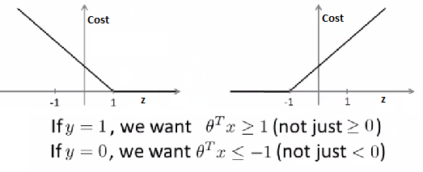

```{r setup, include=FALSE}
knitr::opts_chunk$set(echo = TRUE)
```

> Note: This document is generated using R markdown. Please contact me if you have trouble viewing it.

## Introduction
This document summarized the part of results finished on my behalf for our group project. The structure of the document is organized as following. First, the project scope and problem statement is described again. Next, the key technologies that used to achieve our project goal are introduced. Last, the results for this stage are shown including extracted features and models performance comparison. The current work are available on the [Project Github Repo](https://github.com/mingchen7/YelpChallenge/tree/master).

## Group Project Description
After ther mid-presentation, our project scope is modified a bit to be more centratlized. The goal of this project is to develop an advanced Yelp restaurant recommendation system that is empowered by the utilization of additional publicly accessible features other than traditional Yelp business features. We aimed at including two parts of features to power our recommendation system: Yelp restaurant nearby location features and quantified Yelp review features based on sentiment analysis. All of these two parts of features are processed and aggregated at the business-level. By taking advantage of the ability of content-based recommendation system, we will be able to transfer these features along with traditional business features into Users' preferences over these features (which will be introduced by the other teammate). 

The focus of this document will focus on the work of location features extraction and sentiment analysis of Yelp reviews.

## Methodology
### Crawling Google Map Place Data
The Yelp restaurant nearby location features are crawled using [Google Map Place Web Service API (noted as Google API)](https://developers.google.com/places/web-service/). For a given pair of longitude and latitude, the Google API can return the nearby places information of different categoires (e.g., restaurant, food, theaters, bus stations) within a certian radius.

However, there are some limitations for using the Google API:

1. The maximum requests allowed per day is 150,000.
2. Each request can only query google places for one category.
3. For each request, it only return 20 results in one page. The maximum number of places return for a given request is 3 page, i.e., 60 places. Each page counts once of 150,000 maximum requests.

After pre-liminary data reduction, we have a total of 5667 Yelp restaurants as our targeting businesses in the Phoenix Metropolitan area. In order to crawl all the nearby google places information under the constraints of Google API limitations, I used the strategy described as following. 

1. Identified a total of 15 interested categories from the whole list of google place categories. 
2. Loop over the Yelp restaurants, for each restaurant, request the nearby google places for each category within 500 meters.
3. If additonal pages exist for a single request, loop over all the pages until reach the maximum 60 results.
4. Adding expotentially backoff between two tries of requests if necessary to avoid error due to high traffic.
5. Append the corresponding Yelp business id to each returned google palce infomation (json format), and store into MongoDB NoSQL database.  
5. If the number of requests exceed the maximum limit of 150,000 within 24 hours, terminate the program and start from where it left the next day.

The sample google place data processed is shown as below. ([Click here to see sample data](https://github.com/mingchen7/YelpChallenge/blob/master/GoogleMap%20API/sample_google_place.py)).   
```
{
	"_id" : ObjectId("56ef2aad84bb9d274bd9441e"),  
	"rating" : 4.3,  
	"name" : "Ichi Ban Japanese Restaurant & Sushi",  
	"reference" : "CoQBeAAAAFahBQ0eAdkbsKpSUb5bsyjdV1JyYjV5JmB3b60y4u7f2hDzfDsmnIxJuONFUKvdB6MXmrnySj8hb1UJmii9Ez4m3Kk-VuFmMtQ-8Zbr1IQWXxpWs2hThe1eg6ZyIqHEkhycQGXBSNPcO2tv7r6AcsqDdgIVs1LaaOADAq_nXPPUEhD1KVUKW0fJgV3qmb-N6rsLGhRrW8G6Vr5227jyu9avGIJonUmg-A",  
	"price_level" : 2,  
	"geometry" : {  
		"location" : {  
			"lat" : 33.4793622,  
			"lng" : -112.0732746  
		}  
	},  
	"opening_hours" : {  
		"weekday_text" : [ ],  
		"open_now" : false  
	},  
	"place_id" : "ChIJ9VgZuF0SK4cRZp9HH6C7V7U",  
	"vicinity" : "2815 North Central Avenue, Phoenix",  
	"place_type" : "restaurant",  
	"yelp_id" : "x5Mv61CnZLohZWxfCVCPTQ",  
	"scope" : "GOOGLE",  
	"id" : "ca28c49d74a27b4c7c58197957ea8ce957620d6a",  
	"types" : [  
		"restaurant",  
		"food",  
		"point_of_interest",  
		"establishment"  
	],  
	"icon" : "https://maps.gstatic.com/mapfiles/place_api/icons/restaurant-71.png"  
}  
```

The aggregation of data is performed by querying MongoDB using Python. For each identified category, I calculated the count and Google place rating information(min, avg, max) for a given Yelp restaurant. Some category such as bus station may not have rating information and thus the corresponding rating data are ignored.

### Yelp review sentiment analysis
Another important step for getting more features to power recommendation system is through the sentiment analysis. In order to get more quantitative information from the review text. We used two steps to extract our feature list. The first step is to build a review text classifier to predict a binary label. The second step is to apply the VADER algorithm to get polarity scores (i.e., positive, negative, and neutral).

#### Review classifier
The goal of building review classifier is to predict what perspective the reviewers are talking about. In particular, are they talking about the food, service, ambiance, or price (i.e., four categories). The content of review can be very arbitrary and such a classifier can help use to better understand the quantitative information behind the review. 

To achieve this objective, I have figured it out two alternative solutions. The first one can be noted as word-based classifier and the second is a n-gram based classifier. 

- **Word-based classifier**  
The similar idea of a word-based classifier was initially proposed by Gupta et al. (2009). The method starts by extracting the top N (e.g., N = 1000) highest frequency nouns occurred in the most representative or all review texts. Next, these nouns need to be mannually labeled to match one of the category: food, service, ambiance, and price. Once the nound words are correctly labeled, we can construct a training dataset by using the *hypernyms* of nouns as features (i.e., independent variables). The hypernyms for a noun can be obtained by back-trace the path from the noun (node) to the root in the WordNet Hierarchy tree. This can be implemented using Python's nltk package [NLTK WordNet Hierarchy](http://www.nltk.org/book/ch02.html). The underlying reason support this method is that noun words (for example, pizza and burger) of the same label (for example, food) share lots of common hypernyms. Last, we can train common machine learning algorithms such as Support Vector Machine (SVM) or Neural Networks (NN) to predict the label given a noun word. The model results then can be further applied to the review text to identify the label of a sentence or paragraph of review.

- **N-gram based classifier**  
The second more straightforward method is to use the most frequent n-grams as features to predict the label of a single review. This method starts by extracting the top N (e.g., N = 1000) n-grams (e.g., unigram, bigram, trigram) from the review text. Next, each review for building the training dataset is mannually given a label indicating what category is the review talking about. Once the training dataset is built, we can train a SVM or NN to predict the label. When predicting for a new review, we can similarily construct a feature vector by matching the review to those n-grams as dummy features and use the feature vector to feed the trained model.

Both solutions are applicable but have their own pros and cons. The first solution take much less time to label words mannually (top N words). However, the relationship between the noun words and outcome label is indirect. Moreover, it is hard to distinguish a review when there are several noun words in this review falling into several different categories (For example, a review both contain the wrods "pizza", "queue", "deal"). In particular, the review in reality are more complex than expected so it would be hard to apply this method. The second solution is much more straightforward and the n-grams and outcoming label are directly related. However, it would take much more resources (i.e., time and labor) to build the training dataset.

In this project, I used the second solution but taking advantage of an existing training dataset mannully labeled by Sajnani et. al. The training dataset can be downloaded from [Yelp Dataset for Classifier](http://www.ics.uci.edu/~vpsaini/) for .arff format or from the [Project Github Repo](https://github.com/mingchen7/YelpChallenge/tree/master/dataset/nlp%20classifier) for converted .csv format.

##### **Support Vector Machine**

The Support Vector Machine (SVM) is used to build the review classifier. SVM is a well-known supervised learning model for classification and regression problems. Theoratically, the SVM can be considered as modified version of logistic regression in which the hyperplane (i.e, decision boundary) is chosen to maximize the distance from it to the nearest data point. That is why it is also known as large margin classifiers. The complete cost function for SVM is given by:

$$ \min_{\substack{\theta}}C\sum_{i=1}^m [y^{(i)}cost_1(\theta^Tx^{(i)})]+(1-y^{(i)}cost_0(\theta^Tx^{(i)})] + \frac{1}{2}\sum_{i=1}^n\theta_j^2 $$ 

where $cost_1(\theta^Tx)$ and $cost_0(\theta^Tx)$ are cost functions for $y = 1$ and $y = 0$ correspondingly which can be treated as a linear approximattion of hyppothesis function from logistic regression. The cost functions were shown in the below. C is the cost coefficient or known as regularization term to avoid overfitting.



*Figure 1. cost functions for SVM*

Another important parameter for SMV is the kernel function. The kernel function is defined as a combination of derived feature vector to control the decision boundary. The linear kernel function can only identify a linear decision boundary and other functions such as polynomial, Gaussian (or called RBF) and sigmoid kernels can be used to identify non-linear decision boundary. In this project, I used the Python's scikit-learn package to implement SVM for classification over both linear and non-linear Gaussian kernels.  

#### Vader Score
The VADER (Valence Aware Dictionary for Sentiment Reasoning) is a rule-based model for general sentiment analysis of NLP proposed by Hutto adn Gilbert (2014). The VADER is constructed through a human-centered approach by collecing and examining all lexical features of existing well-established & human validated sentiment lexicons such as LIWC, ANEW, GI. Next, supplementary lexical features commonly used to express sentiment in social media text are integrated to obtain over 9,000 lexical feature candidates. A wisdom-of-crowd (WotC) approach is applied to acquire valid point estimate for the sentiment valence for each lexical feature. A total of 10 qualified raters were hired to giuve a score to all the 9,000 features from -4 (extremely negative )to +4 (extremely positive). The results of these scores are used to consturct rule-based models.

Compared to traditional sentiment lexicons based methods such as Linguistic Inquiry and Word Count (LIWC) and machine learning based methods such as Naive Bayes (NB) classifier, VADER has the following advantages (Hutto and Gilbert, 2014). 
- workds well on social media style text, yet readily generalize to multiple domains]
- require no training data, but is constructed from a generalizable, valence-based, human-curated gold standard sentiment lexicon
- fast enough to apply on online streaming data
- does not suffer from speed-performance trade-off

These advantages play vital roles when analyzing massive Yelp reviews that are collected from social media platform.

## Results
### Yelp Restaurant Nearby Location Features

The processed Yelp restaurant nearby location features can be viewed at Github Repo. [Click here to see processed location features](https://github.com/mingchen7/YelpChallenge/blob/master/dataset/extracted_location_features.csv). The following showed sample rows for the processed location features.


*Figure 2. Processed sample location features*

### Sentiment Analysis of Yelp Review

In the project, I built four SVM classifiers for the review text to predict four labels: IsFoodGood, IsServiceGood, IsAmbianceGood, and IsPriceGood. The feature vector is composed of 668 most frequent unigrams, bigrams and trigrams. The following parameter grid was identified to search optimal settings.

- kernel: {linear, rbf}
- C: {1, 10}
- gamma for rbf kernel: {0.001, 0.0001} 

```{r include=FALSE, cashe=FALSE} 
library(ggplot2)
library(grid)
library(gridExtra)
```

```{r echo=FALSE, fig.width = 8, fig.height = 6}
x = c('linear-1', 'linear-10','rbf-1-0.001','rbf-1-0.0001','rbf-10-0.001','rbf-10-0.0001')
food_y = c(0.769,0.771,0.706,0.589,0.766,0.706)
service_y = c(0.763, 0.761, 0.689, 0.628, 0.761, 0.691)
ambiance_y = c(0.758, 0.758, 0.668, 0.614, 0.759, 0.689)
price_y = c(0.853, 0.853, 0.790, 0.790, 0.835, 0.790)
dat = cbind(x, food_y, service_y, ambiance_y, price_y)
dat = as.data.frame(dat)
names(dat) = c('model','food_accuracy','service_accuracy','ambiance_accuracy','price_accuracy')
p_food = ggplot(data=dat, aes(x=model, y=food_accuracy)) + 
         geom_bar(stat="identity", fill = "red") + 
         ggtitle("Mode comparison for IsFoodGood") + 
         xlab("Model specification") + 
         ylab("Model Accuracy") + 
         theme(text = element_text(size=12), axis.text.x = element_text(angle = 45, hjust = 1), plot.title = element_text(size = 14))
  
p_service = ggplot(data=dat, aes(x=model, y=service_accuracy)) + 
         geom_bar(stat="identity", fill = "deepskyblue") + 
         ggtitle("Model comparison for IsServiceGood") + 
         xlab("Model specification") + 
         ylab("Model Accuracy") + 
         theme(text = element_text(size=12), axis.text.x = element_text(angle = 45, hjust = 1), plot.title = element_text(size = 14))

p_ambiance = ggplot(data=dat, aes(x=model, y=ambiance_accuracy)) + 
         geom_bar(stat="identity", fill = "purple") + 
         ggtitle("Model comparison for IsAmbianceGood") + 
         xlab("Model specification") + 
         ylab("Model Accuracy") + 
         theme(text = element_text(size=12), axis.text.x = element_text(angle = 45, hjust = 1), plot.title = element_text(size = 14))

p_price = ggplot(data=dat, aes(x=model, y=price_accuracy)) + 
         geom_bar(stat="identity", fill = "chocolate1") + 
         ggtitle("Model comparison for IsPriceGood") + 
         xlab("Model specification") + 
         ylab("Model Accuracy") + 
         theme(text = element_text(size=12), axis.text.x = element_text(angle = 45, hjust = 1), plot.title = element_text(size = 14))
grid.arrange(p_food, p_service, p_ambiance, p_price, ncol = 2)
```  

*Figure 3. SVM model comparison over different parameter settings*

The processed Yelp review sentiment analysis features can be viewed at Github Repo. [CLieck here to see processed review features](https://github.com/mingchen7/YelpChallenge/blob/master/dataset/extracted_review_features.csv). The following showed the sample rows for the processed review features. In the feature vector, four binary variables (i.e., IsFoodGood, IsServiceGood, IsAmbianceGood, and IsPriceGood) are predicted by the developed SVM review classifier. The afterward four features (i.e., vader_compound, vader_neg, vader_neu, and vader_pos) are calculated from VADER algorithm.


*Figure 3. Processed sample review sentiment features*

The model selection is performed based on the mean absoluate error (MAE) measure. The MAE measure is calculated based on 5-fold cross-validation. This enire model evaluation and validation process is implemented using [Python Scikit-learn package](http://scikit-learn.org/stable/modules/svm.html#svm-kernels). 


## Reference
1. Google Map Place Web Service API. https://developers.google.com/places/web-service/. Avaible by April 2016.
2. Hutto, C. J., & Gilbert, E. (2014, May). Vader: A parsimonious rule-based model for sentiment analysis of social media text. In Eighth International AAAI Conference on Weblogs and Social Media.
3. Gupta A., Tenneti, T., Gupta, A. (2009). Sentiment based Summarization of Restaurant Reviews. http://nlp.stanford.edu/courses/cs224n/2009/fp/9.pdf.
4. Sajnani H., Saini, V., Kumar, K., Gabreilova, E., Choudary, P., Lopes, C. Yelp review classifier dataset. http://www.ics.uci.edu/~vpsaini/, Available by April 2016.
5. Scikit-learn SVM. http://scikit-learn.org/stable/modules/svm.html#svm-kernels. 
